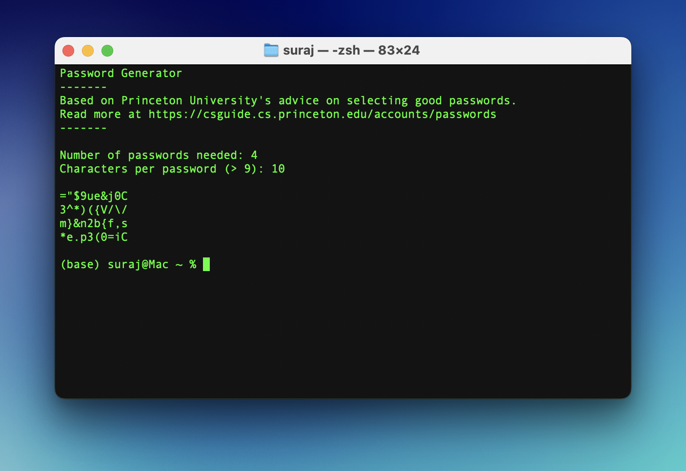

# Password-Generator
This password generator is based on Princeton University's advice on selecting a good password: https://csguide.cs.princeton.edu/accounts/passwords

The program requires that the input from the user for the number of passwords is a valid int and > 0, and also makes sure that the number of characters for the password to be generated is at least 10 characters. This helps meet the requirements for a good password as per Princeton University.

The program uses the random library to pick from the possible characters, and also imports os to clear the terminal while running the program.
